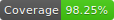

# Outlyer frontend recruitment test



## Setup

1. Install `node` & `yarn`
1. Run `yarn install` to install dependencies
1. Create a `.env` configuration file and provide required properties. Please use the provided `.env.example` as a starting point.
    ```
    cp ./.env.example ./.env
    ```
1. Clone, install, and start the [`frontend-server`](https://github.com/rudasn/outlyer-frontend-server)

## Usage

Run `yarn start` to start the development server

## Testing

Run `yarn test` for unit testing in watch mode or `yarn test:coverage` to create a test coverage report (created under `./coverage`).

## Production build

To create a production build (runs tests first) run `yarn build:production`.

---

Thanks for taking the time to do our frontend coding test. The challenge has two parts:

1) a [task](#task) to create a basic chart and trend arrow by consuming data from an API endpoint.

2) some [follow-up questions](./FOLLOWUP.md)

## Task

- Consume an API endpoint (https://api.bitfinex.com/v1/pubticker/btcgbp) that returns the latest BTC/GBP price from Bitfinex.

- Create a page that populates a timeseries chart along the time the page is open, and a trend arrow, with a percentage value next to it.

- The chart should show the values of the fetched prices along the time.

- The trend arrow should be coloured (red for decrease, green for increase) and show the direction (up or down), showing the trend between the most recent value and the previous value, along with a percentage value showing the difference.

- The new price should be fetched every 30s, and the chart, arrow and percentage value should update accordingly.

- Make it look nice - it should be properly styled and the page should adapt to different screen sizes.

- All the components you create have to be properly unit-tested (jest is already ready to use).

## Implementation

- The page should be built with React and also include a redux store for storing the fetched prices along the time and used for populating the chart.

- The code has to be written in EcmaScript 6.

- To get around the CORS issue when fetching the data you can use CORS anywhere (https://cors-anywhere.herokuapp.com/).

- Use a charting library of your own choosing.

- BONUS POINTS: Instead of using CORS anywhere, implement a server that calls the endpoint and proxies the data to the client.

## Submission Guidelines

* Please submit your application as a repository on github.

* Your repository should contain the frontend-test project folder (and the server project folder in case you implemented the proxy server) with your submission.

* Please submit an explanation document for your work addressing all the questions contained in the [FOLLOWUP.md](./FOLLOWUP.md) file. This should be no more than 1000 words

* The respository should **not** include the `node_modules` folder.

* Please let your Outlyer contact know when you've uploaded your solution.
