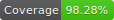

# Bitcoing Tracker



## Setup

1. Install `node` & `yarn`
1. Run `yarn install` to install dependencies
1. Create a `.env` configuration file and provide required properties. Please use the provided `.env.example` as a starting point.
    ```
    cp ./.env.example ./.env
    ```
1. Clone, install, and start the [`frontend-server`](https://github.com/rudasn/outlyer-frontend-server)

## Usage

Run `yarn start` to start the development server

## Testing

Run `yarn test` for unit testing in watch mode or `yarn test:coverage` to create a test coverage report (created under `./coverage`).

## Production build

To create a production build (runs tests first) run `yarn build:production`.
